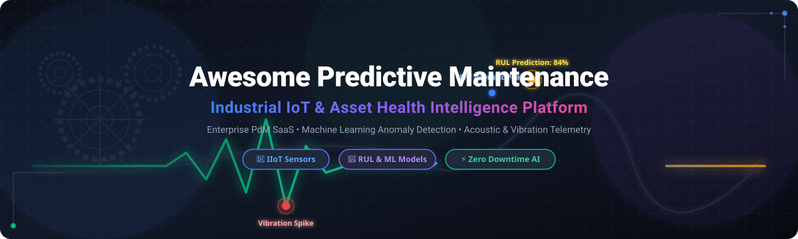

# Awesome Predictive Maintenance Platform 🛠️⚡

<p align="center">
  
</p>

<p align="center">
  <a href="https://github.com/ishandutta2007/Awesome-Awesome-Awesome"></a>
  <a href="https://discord.gg/jc4xtF58Ve"></a>
  <a href="https://github.com/ishandutta2007/Awesome-Predictive-Maintenance-Platform/stargazers"></a>
  <a href="https://github.com/ishandutta2007/Awesome-Predictive-Maintenance-Platform/network/members"></a>
  <a href="https://github.com/ishandutta2007/Awesome-Predictive-Maintenance-Platform/blob/main/LICENSE"></a>
  <a href="https://github.com/ishandutta2007"></a>
</p>

---

## 🌟 Top Predictive Maintenance (PdM) Platforms Ecosystem

**A Curated List of Enterprise SaaS Products, Machine Health AI Tools & Open-Source GitHub Projects**

*Focused on Industrial IoT (IIoT), Condition Monitoring, Vibration & Acoustic Analytics, Remaining Useful Life (RUL) Estimation, Anomaly Detection & Asset Reliability.*

**Last updated: September 2026** 📅

---

### 📖 Introduction & Overview

Welcome to the **Awesome Predictive Maintenance Platform** directory! 🚀 

This repository tracks top-tier **SaaS platforms**, enterprise industrial software, and **open-source GitHub repositories** designed for **Predictive Maintenance (PdM)**, asset health monitoring, and operational intelligence. By combining high-frequency sensor telemetry (vibration, acoustics, temperature, motor current) with advanced Machine Learning (ML) and domain expertise, these solutions empower reliability engineers and plant managers to prevent unplanned downtime, optimize maintenance schedules, and boost equipment lifespan.

---

## 📑 Table of Contents

- [📊 Sector Overview & Market Dynamics](#-sector-overview--market-dynamics)
- [🏢 SaaS & Hosted Enterprise Platforms](#-saas--hosted-enterprise-platforms)
- [💻 Open-Source GitHub Projects](#-open-source-github-projects)
- [🤝 How to Contribute](#-how-to-contribute)
- [💖 Support & Sponsorship](#-support--sponsorship)
- [📈 Star History](#-star-history)
- [⚠️ Disclaimer](#%EF%B8%8F-disclaimer)

---

## 📊 Sector Overview & Market Dynamics

> 💡 **Market Size & Growth**: The global **Predictive Maintenance (PdM) market size** is estimated at **$13.4 Billion to $19.8 Billion in 2026**, growing at a robust Compound Annual Growth Rate (CAGR) of ~25%–30% towards an estimated $80+ Billion by the 2030s.

> 🧩 **Market Fragmentation**: The market is **moderately fragmented**. It is anchored by large industrial automation and enterprise cloud giants (e.g., IBM, Siemens, Rockwell Automation, C3 AI) alongside fast-growing specialized AI asset health unicorns (e.g., Augury, Uptake, SparkCognition, AssetWatch). It is not a strict "winner-take-all" market; rather, specialized domain verticalization (heavy machinery, rotating equipment, manufacturing, rail, oil & gas) creates ample space for specialized platforms and IIoT sensor innovators.

---

## 🏢 SaaS & Hosted Enterprise Platforms

*Below is a curated table of leading commercial Predictive Maintenance platforms, sorted by **Company Scale (Valuation / Revenue)** in descending order.* 📈

| Product 🛠️ | Description 📝 | Company Scale (Valuation / Revenue) 💰 | Starting Tier Pricing 🏷️ | Free Tier / Trial Limit 🎁 |
| :--- | :--- | :--- | :--- | :--- |
| **[IBM Maximo Monitor](https://www.ibm.com/products/maximo)** | Asset monitoring and anomaly detection application within the IBM Maximo Application Suite. | **~$234.7B Market Cap** ($68.9B Revenue) | ~$40,000/year (IBM AppPoints subscription model) | No permanent free tier; time-limited demo/trial via IBM or AWS Marketplace |
| **[Senseye (Siemens)](https://www.siemens.com/)** | Siemens’ enterprise predictive maintenance platform using AI & industrial data to anticipate equipment failures. | **~$120B+ Parent Cap** (~$4.7M Senseye Revenue) | Custom quote-based (Per-asset monthly subscription via Siemens sales) | No free tier or trial (Consultation & demo available) |
| **[Fiix Foresight](https://fiixsoftware.com/)** | Predictive maintenance and AI insights within the Fiix CMMS/EAM platform (Acquired by Rockwell Automation). | **~$30B+ Parent Cap** (~$23.5M Fiix Revenue) | Free tier ($0) / Paid starting at $45/user/month (Basic plan) | Permanent Free plan limited to 3 users, 25 active PM tasks, and ~20 assets |
| **[Uptake](https://www.uptake.com/)** | Industrial AI and predictive analytics platform oriented toward heavy equipment & fleet health (rail, mining, construction). | **~$2.3B Valuation** (~$100M ARR) | ~$100,000/year platform licensing (Enterprise quote-based) | No free tier or trial (Guided demo available) |
| **[SparkCognition](https://www.sparkcognition.com/)** | Enterprise AI platform offering predictive maintenance, asset analytics, and visual AI solutions. | **~$1.4B Valuation** (~$75M–$137M Revenue) | Custom quote-based (Scales by deployment scope and fleet size) | No free tier or trial (Guided demo available) |
| **[C3 AI Reliability](https://c3.ai/)** | Enterprise AI application for predictive maintenance and reliability within the C3 AI platform. | **~$1.38B Market Cap** ($250.3M FY26 Revenue) | $0.55/vCPU-hour ($250k for 3-month pilot engagement) | No full platform free tier; 14-day trial for select cloud marketplace modules |
| **[Augury](https://www.augury.com/)** | AI-powered machine health & predictive maintenance platform combining continuous vibration/acoustic sensor data with expert analysis for process industries. | **~$1.0B Valuation** (~$155M Revenue) | ~$50–$150/monitored machine/month (Hardware/installation quoted separately) | No free tier or trial (Demo & ROI calculator only) |
| **[AssetWatch](https://www.assetwatch.com/)** | End-to-end machine health monitoring platform with wireless sensors and expert advice. | **~$430M Valuation** (Series B Funded) | $199 upfront trial fee; full service quote-based subscription | 30-day paid trial plan for $199 (Includes sensors & cloud access) |
| **[Infinite Uptime](https://www.infinite-uptime.com/)** | Industrial IoT & prescriptive maintenance solution for high-frequency vibration and acoustic monitoring. | **~$158M Valuation** (~$113M Revenue) | Custom quote-based (Hardware sensors per unit + PlantOS subscription) | No free tier or trial (On-site demo & proof of concept available) |
| **[Nanoprecise](https://www.nanoprecise.io/)** | Predictive maintenance solution focused on vibration, acoustic, and thermal sensor analytics for industrial assets. | **~$50M+ Valuation** (~$9.2M Revenue) | Custom quote-based (Subscription per monitoring point/asset) | No free tier or trial (30-min expert demo available) |

---

## 💻 Open-Source GitHub Projects

*Open-source options for building custom Predictive Maintenance (PdM) pipelines, time-series anomaly detection, IIoT edge monitoring, and RUL estimation. Sorted by **GitHub_Stars** in descending order.* 🌟

- **[ThingsBoard](https://github.com/thingsboard/thingsboard)**  
  [](https://github.com/thingsboard/thingsboard/stargazers)  
  Open-source Industrial IoT (IIoT) platform for data collection, processing, visualization, condition monitoring, and device management.

- **[PyOD (Python Anomaly Detection)](https://github.com/yzhao062/pyod)**  
  [](https://github.com/yzhao062/pyod/stargazers)  
  Comprehensive and scalable Python toolkit for detecting outlying / anomalous observations in multivariate sensor data.

- **[sktime](https://github.com/sktime/sktime)**  
  [](https://github.com/sktime/sktime/stargazers)  
  Unified framework for machine learning with time series, supporting forecasting, classification, regression, and anomaly detection for PdM.

- **[awesome-predictive-maintenance](https://github.com/caglarmert/awesome-predictive-maintenance)**  
  [](https://github.com/caglarmert/awesome-predictive-maintenance/stargazers)  
  Curated list of predictive maintenance research papers, benchmark datasets, and open-source implementation repositories.

- **[Apache StreamPipes](https://github.com/apache/streampipes)**  
  [](https://github.com/apache/streampipes/stargazers)  
  Self-service Industrial IoT toolbox to enable non-technical users to connect, analyze, and explore IIoT data streams for condition monitoring.

- **[Awesome-Industrial-AI](https://github.com/ishandutta2007/Awesome-Industrial-AI)**  
  [](https://github.com/ishandutta2007/Awesome-Industrial-AI/stargazers)  
  Curated ecosystem tracking Industrial AI, smart manufacturing, computer vision for quality, and predictive asset management.

- **[Azure AI Predictive Maintenance](https://github.com/Azure/AI-PredictiveMaintenance)**  
  [](https://github.com/Azure/AI-PredictiveMaintenance/stargazers)  
  Microsoft reference architecture and sample implementations for predictive maintenance on turbofan engine dataset using PySpark and ML models.

- **[IoT Predictive Maintenance Simulation](https://github.com/karimosman89/iot-predictive-maintenance)**  
  [](https://github.com/karimosman89/iot-predictive-maintenance/stargazers)  
  End-to-end simulated IoT architecture for ingesting sensor streaming data and running predictive maintenance ML classification models.

- **[Predictive Maintenance Dataset Helper](https://github.com/kokikwbt/predictive-maintenance)**  
  [](https://github.com/kokikwbt/predictive-maintenance/stargazers)  
  Open-source utility and benchmark notebooks for preparing NASA C-MAPSS and turbofan engine degradation datasets for PdM ML modeling.

---

### 🛠️ Architecting Custom Open-Source Systems

```
[Industrial Sensors & PLCs]
        │
        ▼ (MQTT / OPC-UA)
[ThingsBoard / Apache StreamPipes (IIoT Ingestion)]
        │
        ▼ (Time-Series Telemetry)
[PyOD / sktime (ML Anomaly & RUL Analytics)]
        │
        ▼ (Alerts & Health Index)
[CMMS / Work-Order Systems (e.g. Fiix / Odoo)]
```

---

## 🤝 How to Contribute

Contributions are highly welcome! To add or update an entry:

1. 🍴 **Fork** this repository.
2. 📝 Add your entry under the appropriate section following the existing table or list format.
3. 🔗 Include project name, direct URL, factual 1–2 sentence description, and Stars_Badge or pricing info.
4. 🚀 Submit a **Pull Request (PR)** with a descriptive title.

---

## 💖 Support & Sponsorship

If you find this curated list helpful for your industrial AI research, reliability engineering, or project selection, please consider supporting the project!

- ⭐ **Star this repository** to show your appreciation.
- 🍴 **Fork it** to keep a personal copy.
- 📢 **Share it** with fellow reliability engineers and industrial ML teams.
- ☕ **Buy me a coffee / Sponsor**: If you'd like to support ongoing updates and open-source maintenance, visit my [GitHub Sponsor Dashboard](https://github.com/sponsors/ishandutta2007).

---

## 📈 Star History

[](https://star-history.dera.page/#ishandutta2007/Awesome-Predictive-Maintenance-Platform&type=date&legend=top-left)

---

## ⚠️ Disclaimer

- This directory is **community-curated** for informational and educational purposes.
- Predictive maintenance systems affect decisions regarding heavy machinery operation, industrial safety, and maintenance downtime. Self-built or open-source solutions require rigorous testing and domain expertise before production deployment.

---

**Made with ❤️ for reliability engineers, maintenance leaders, and industrial AI pioneers.**
